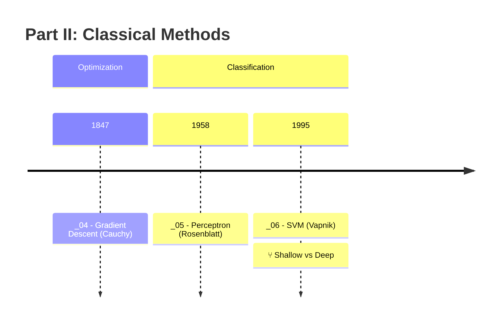
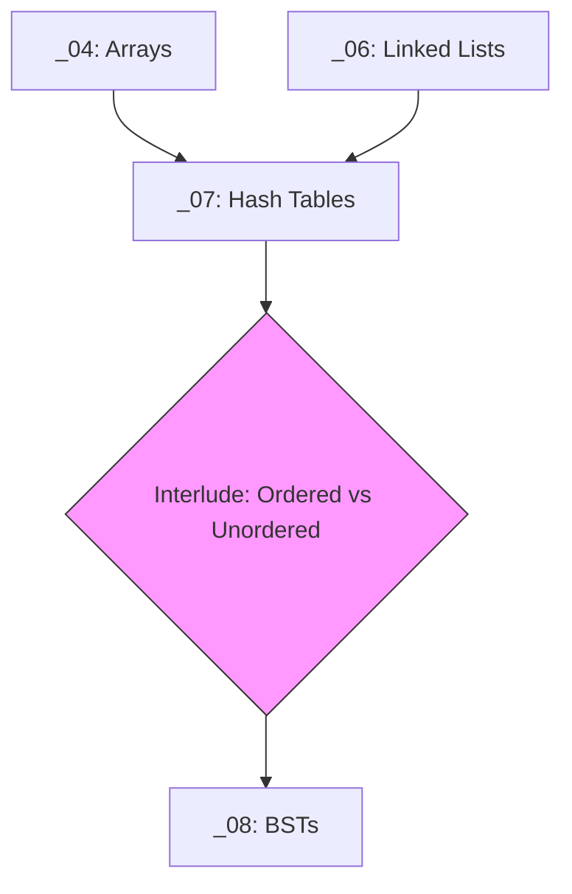

# Book Typography

Visual and typographic enhancements for mdBook projects. Four features
that layer onto the core book structure.

**Tier availability** (see `book-project/references/planning-tiers.md`):
- pamphlet: skip
- micro: margin notes only
- small+: all features

---

## Margin Notes

See `references/margin-notes.md` for the full spec with CSS.

Short asides rendered in the right margin on wide screens, collapsing
inline on narrow screens. No JavaScript required.

### Authoring

```html
<aside class="margin-note" data-type="history">
Rosenblatt built the first perceptron in hardware at Cornell in 1958.
</aside>
```

### Note Types

| Type | Prefix | Use for | Border color |
|------|--------|---------|-------------|
| `note` | **Note:** | Supplementary fact | blue |
| `history` | **History:** | Historical anecdote | amber |
| `tip` | **Tip:** | Practical advice | green |
| `remember` | **Remember:** | Flashcard material | purple |
| `caution` | **Caution:** | Common mistake | red |
| `ref` | **Ref:** | Citation or pointer | gray |

### Rendering

| Context | How it renders |
|---------|---------------|
| mdBook | Right margin via CSS (theme/sidenotes.css) |
| presenterm | Column layout `[3, 1]`, notes as blockquotes in right column |
| Plain markdown | `<aside>` tags ignored (acceptable, notes are supplementary) |

### Guidelines
- 2-5 per chapter. 1-3 sentences each.
- Never critical info. Chapter must work without them.
- `remember` notes feed flashcard generation.
- `tip`/`caution` notes feed cheatsheet "Watch Out For."

---

## Mermaid Timelines

See `references/timelines.md` for the full spec.

Two levels: per-part and full-book. Uses Mermaid's `timeline` diagram
type with `mdbook-mermaid` preprocessor.



Rules:
- Sibling chapters share the same year (stack vertically).
- Interludes use year ranges and `⑂` fork marker.
- Reference table below mermaid block for linking (not natively clickable).
- Omitted entirely in `conceptual` mode (no history).

---

## Auto-Generated Glossary

See `references/glossary-spec.md` for the full spec.

Tag terms inline in chapter prose:

```markdown
A {{perceptron}} is a single trainable unit with adjustable weights.
```

Build script collects all `{{term}}` occurrences and generates
`book/src/glossary.md` with:
- Term (bold, alphabetized)
- One-sentence definition (from defining chapter context)
- Defined in (link to first chapter)
- Also referenced in (links to other chapters)

Override definitions in `book/src/glossary-overrides.toml` when
auto-extracted sentences aren't ideal.

---

## Connections Map (connections.mermaid)

A single Mermaid `graph TD` diagram showing the full tech tree.



- Chapters are rectangular nodes.
- Interludes are diamond nodes with distinct fill color.
- Dependencies are directed edges.
- Generated at project start, updated when chapters change.

---

## Reference Files

- `references/margin-notes.md` -- authoring syntax, CSS, rendering per context
- `references/timelines.md` -- mermaid timeline format spec
- `references/glossary-spec.md` -- inline tagging, build script, overrides
